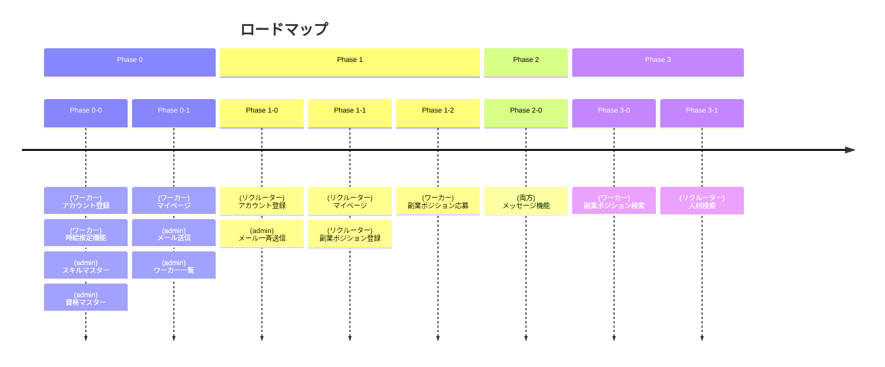

# ロードマップ

本ページでは、フクム事業がどのように成長していくかの計画を記していきます。

フクムでは事業の成長度合いをフェーズごとに切っていきます。
各フェーズごとでフクムの事業運営状況が大きく変わっていく想定です。

## Phase 0

Phase 0ではワーカーが副業を探すにあたって必要な情報を吸い上げ、最小単位での副業マッチング事業のMVP探索を行います。

### Phase 0-0

|項目|内容|
|:--:|:--:|
|狙い|バックオフィス人材の副業サービスが社会的に需要があるかを確認する|
|ゴール|ワーカーのアカウント登録数30人|

以下のコンテンツをプロダクトとして提供します。

- 自身のスキルと業務経験年数を登録をしてもらう
- スキルの数から推定時給を発表（占い的な機能）
- アカウント登録と基本情報入力
- ワーカー向けLP

### Phase 0-1

|項目|内容|
|:--:|:--:|
|狙い|副業に興味ある人材の詳細な情報取得、法人営業開始|
|ゴール|ワーカーのアカウント登録数100人と月100,000円の売上|

以下のコンテンツをプロダクトとして提供します。

- ワーカーのマイページ
- ワーカー自身の保持している資格入力
- 経歴入力（ただし業務内容は箇条書き40文字以内5行までの制約）
- メルマガ停止機能
- リクルーター向けLP

## Phase 1

副業ポジションベースでリクルーターやワーカーの意図を反映させる機能を充実させ、副業マッチングを加速させていきます。
Phase 0ではフクムの運営人員が手動で副業マッチングを行なっていたところを、Phase 1以降ではシステムベースによるマッチングの半自動化を行なってきます。

### Phase 1-0

|項目|内容|
|:--:|:--:|
|狙い|副業案件ベースでのワーカーアカウント増加|
|ゴール|ワーカーのアカウント登録数500人と月500,000円の売上|

以下のコンテンツをプロダクトとして提供します。

- リクルーターマイページ
- リクルーターによる副業ポジション登録

### Phase 1-1

|項目|内容|
|:--:|:--:|
|狙い|手動マッチングからの卒業|
|ゴール|ワーカーのアカウント登録数1000人と月1,000,000円の売上|

以下のコンテンツをプロダクトとして提供します。

- ワーカーマイページからの副業ポジション応募

### Phase 1-2

|項目|内容|
|:--:|:--:|
|狙い|レスポンス性の向上|
|ゴール|ワーカーのアカウント登録数1000人と月1,000,000円の売上|

以下のコンテンツをプロダクトとして提供します。

- ワーカー&リクルータ：案件マッチング通知

## Phase 2

Phase 1によって成約作業がシステムベースで実現されたのに対し、Phase 2では仲介作業がシステム上で実現されるようになります。
メッセージ機能を実装し、フクム上で副業案件についてのやり取りが行えるようにします。

### Phase 2-0

|項目|内容|
|:--:|:--:|
|狙い|仲介による成約からユーザー間での成約へ(運営負荷を低減)|
|ゴール|ワーカーのアカウント登録数2,000人と月3,000,000円の売上|

以下のコンテンツをプロダクトとして提供します。

- メッセージ機能

なお、メッセージ機能実装にあたって電気通信事業の届出を行う必要があります。

## Phase 3

サービスとしての利便性向上を考え、ワーカーや副業ポジションの検索機能を提供し、フクムが人材スカウトサービスとして確立させることを狙います。

### Phase 3-0

|項目|内容|
|:--:|:--:|
|狙い|運営負荷を低減|
|ゴール|ワーカーのアカウント登録数3,000人と月5,000,000円の売上|

以下のコンテンツをプロダクトとして提供します。

- 副業ポジションの検索

### Phase 3-1

|項目|内容|
|:--:|:--:|
|狙い|運営負荷を低減|
|ゴール|ワーカーのアカウント登録数4,000人と月7,000,000円の売上|

以下のコンテンツをプロダクトとして提供します。

- 人材検索

## その後の展開

大きくフェーズで事業状況を区切っていきますが、事業進捗上は多少はプロダクトとしての提供機能が前後する可能性は大いにあります。

なお、Phase 3以降でどのようなことを行うかはまだ考えていませんが、フクム事業においてはナレッジ共有とコミュニケーション、ネットワーキングに本質的な価値があると考えていて、フクム事業の最後の鍵になるのは人間であると考えています。
というのも、SmartHRやマネーフォワードなど、バックオフィスドメインの便利なサービスは世の中に溢れているのですが、現代の業務プロセスの苦しみはこれらのツールを上手に使いこなせないことに本質があると考えているからです。

そのため、フクムとして何かしらのSaaSなどを開発する気は全くありません。

一方で、こうした価値基準に軸足を置き、以下のような事業展開の可能性を考えています。

- 教育系
  - セミナーの実施
  - 資格制度
- コミュニティ
  - ナレッジ共有のための掲示板サービス
