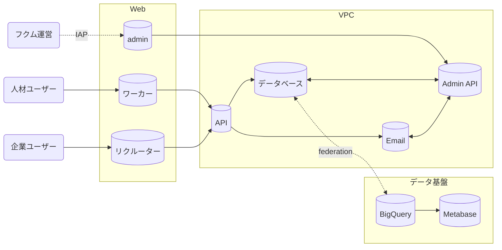

# アーキテクチャ

フクムというプロダクトがどのように動いているかを解説していきます。

## 全体像

サービス全体はGoogle Cloudで動いており、以下の各サーバーはCloud Runで動いています。

## 技術スタック

WebクライアントはNext.jsを使用し、APIサーバーにはGoを利用しています。

フクムでは将来的にモバイルアプリに展開する可能性を見据え、WebクライアントとAPIサーバーの疎通にはgRPCを利用しており、実装としては[Connect](https://connectrpc.com/)を採用しています。

また、図から省略していますが認証系のIDaaSとしてはFirebase Authを利用しており、データベースではFirebase Authユーザーの情報と対応させる形でユーザーIDを払い出して管理しています。

ただ、Firebase Authの取り回しの悪さから、近いうちに認証系を自前実装する方針へ切り替えていきたいと考えています。

## データ基盤

フクムはユーザーデータを活用したサービスであるため、サービスの早いタイミングからデータ基盤を整備し、BIツールとして[Metabase](https://www.metabase.com/)を採用しています。

データ整備ツールとしては[dbt](https://www.getdbt.com/)を活用し、GitHub Actions上でcronで実行しています。
